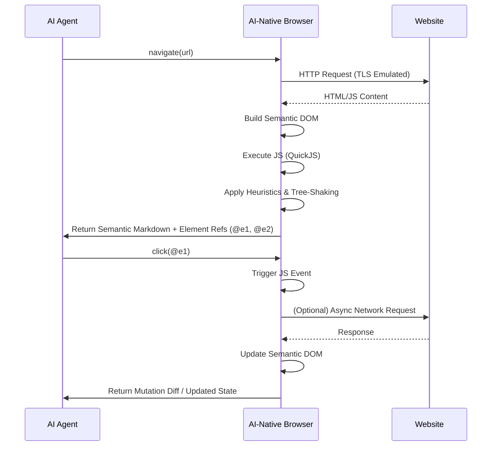

# Forschungsbericht: Architektur eines AI-Native Browsers für Symaira

## 1. Architektur der Execution Engine

### 1.0 Gesamtarchitektur

```mermaid
graph TD
    subgraph "Symaira AI-Native Browser Architecture"
        Agent[AI Agent / Hermes / OpenClaw]
        API[Agent Interaction Interface / Primitives]
        
        subgraph "Execution Engine (Rust/Zig)"
            HTTP[HTTP Layer / TLS-Fingerprinting Emulation]
            Parser[HTML Parser / Semantic DOM Builder]
            DOM[Semantic DOM / No-Layout Tree]
            JS[JS Engine / QuickJS / Goja]
        end
        
        subgraph "Semantic Optimization Layer"
            Shaking[Tree-Shaking / Tag Filtering]
            Heuristics[Prioritization Heuristics]
            Transform[Markdown/JSON Transformer]
        end
        
        Web[Target Website / SPA]
        
        Agent <--> API
        API <--> DOM
        API <--> JS
        DOM <--> Parser
        Parser <--> HTTP
        HTTP <--> Web
        JS <--> DOM
        DOM --> Shaking
        Shaking --> Heuristics
        Heuristics --> Transform
        Transform --> Agent
    end
```

Abbildung 1: Gesamtarchitektur des Symaira AI-Native Browsers.

### 1.1 Schlanke Browser-Architektur

Projekte wie Lightpanda zeigen, dass eine solche Architektur in Sprachen wie Zig (ähnlich Go oder Rust in Bezug auf Performance und Speicherkontrolle) realisierbar ist [2] [3]. Die Kernkomponenten einer solchen Engine umfassen:

*   **HTTP-Schicht**: Eine effiziente Bibliothek wie `libcurl` (C-basiert, aber in Zig/Go/Rust integrierbar) oder native Implementierungen in Go/Rust für die Verarbeitung von HTTP-Requests [3].
*   **HTML-Parser**: Ein schneller HTML-Parser, der den DOM-Baum aufbaut, ohne unnötige Informationen für das visuelle Rendering zu berücksichtigen. `html5ever` (in Rust geschrieben) ist ein Beispiel für eine solche Bibliothek [3].
*   **DOM-Baum**: Eine maßgeschneiderte DOM-Implementierung, die nur die für die Interaktion und semantische Analyse relevanten Informationen speichert. Dies reduziert den Speicherbedarf erheblich im Vergleich zu einem vollständigen DOM, der für visuelles Rendering optimiert ist [2].
*   **JavaScript-Ausführung**: Eine leichtgewichtige JavaScript-Engine, die die Ausführung von clientseitigem Skript ermöglicht, ohne den Overhead einer vollständigen V8-Engine. Dies ist entscheidend für moderne SPAs.

### 1.2 JavaScript-Engines

Die Wahl der JavaScript-Engine ist kritisch. V8, die Engine von Chrome, ist leistungsstark, aber auch sehr ressourcenintensiv. Alternativen, die für einen AI-Native Browser besser geeignet sein könnten, sind:

*   **QuickJS**: Eine kleine und einbettbare JavaScript-Engine, die ES2023-Spezifikationen unterstützt. Sie zeichnet sich durch einen geringen Speicherverbrauch aus [4]. Obwohl sie in einigen Benchmarks langsamer als V8 sein kann, ist ihr geringer Ressourcenverbrauch für den AI-Native Browser vorteilhaft [5].
*   **Goja**: Eine in Go geschriebene JavaScript-Engine, die ebenfalls einen geringen Speicherverbrauch aufweist und für viele Anwendungsfälle sogar schneller als V8 sein kann [6] [7].

Die Performance dieser Engines im Kontext moderner Web-Apps hängt stark von der Komplexität des auszuführenden JavaScripts ab. Für einen AI-Native Browser, der primär auf die Extraktion und Interaktion abzielt, könnten QuickJS oder Goja eine gute Balance zwischen Performance und Ressourcenverbrauch bieten.

### 1.3 Session- und Cookie-Management

Ein effizientes Session- und Cookie-Management ist für paralleles Browsing unerlässlich. Dies könnte durch folgende Ansätze realisiert werden:

*   **Isolierte Kontexte**: Jede Agenten-Sitzung erhält einen eigenen, isolierten Speicherbereich für Cookies und Session-Daten. Dies verhindert Interferenzen zwischen parallelen Agenten.
*   **Persistenz**: Cookies und Session-Daten können bei Bedarf persistent gespeichert werden, um Sitzungen über mehrere Anfragen hinweg aufrechtzuerhalten.
*   **Concurrency-Modell**: Die Engine muss ein robustes Concurrency-Modell (z.B. Go-Routinen in Go oder `async`/`await` in Rust) verwenden, um mehrere isolierte Browser-Kontexte gleichzeitig zu verwalten und HTTP-Anfragen parallel zu verarbeiten.

## 2. LLM- & Token-Optimierung (Der "Semantic DOM")

Die Transformation des rohen HTML/JS-Zustands in ein für LLMs token-effizientes und lesbares Format ist ein Kernaspekt des AI-Native Browsers. Das Ziel ist ein 
„Semantic DOM“, der nur die relevanten Informationen für den KI-Agenten enthält und gleichzeitig die Token-Kosten minimiert [8].

### 2.1 Transformation für LLMs

*   **Automatisches Tree-Shaking**: Entfernung von CSS, redundantem HTML-Markup (z.B. leere `div`s, nicht sichtbare Elemente), Kommentaren und Skripten, die nicht zur semantischen Bedeutung beitragen. Nur interaktive Elemente und der Hauptinhalt sollten erhalten bleiben.
*   **Minimalistisches Markdown oder strukturiertes JSON**: Der bereinigte DOM kann in ein stark reduziertes Markdown-Format oder ein strukturiertes JSON-Objekt umgewandelt werden. Markdown ist oft gut lesbar für LLMs und kann visuelle Hierarchien durch Überschriften und Listen abbilden. JSON bietet eine maschinenlesbare Struktur, die für die direkte Verarbeitung durch Agenten vorteilhaft ist [9].
*   **ARIA-Attribute und semantische Tags**: Nutzung von ARIA-Attributen und semantischen HTML5-Tags (z.B. `<article>`, `<nav>`, `<main>`) zur besseren Identifizierung von Inhaltsbereichen und deren Bedeutung, auch ohne visuelles Rendering [8].

### 2.2 Priorisierungs-Heuristiken

Die Engine sollte Heuristiken implementieren, um den Hauptinhalt von sekundären Elementen zu trennen:

*   **Inhaltsanalyse**: Algorithmen zur Erkennung des Hauptinhaltsbereichs einer Seite (z.B. basierend auf Textdichte, Elementgröße, Position im DOM). Dies kann durch Techniken wie Readability.js oder ähnliche Ansätze inspiriert werden.
*   **Struktur-Erkennung**: Identifizierung von Navigationsleisten, Footern, Sidebars und Werbeblöcken, um diese zu priorisieren oder zu filtern. Dies kann durch vordefinierte Selektoren oder maschinelles Lernen erfolgen.
*   **Interaktions-Relevanz**: Priorisierung von Elementen, die für die Agenten-Interaktion relevant sind (Formularfelder, Buttons, Links), und deren Kontext für die LLM-Verarbeitung aufbereiten.

## 3. Agenten-Interaktions-Schnittstelle (Primitives)

Abbildung 2: Sequenzdiagramm der Agenten-Interaktion mit dem AI-Native Browser.

### 3.1 Optimales API-Design

Die API sollte Primitives bereitstellen, die es Agenten ermöglichen, mit der Seite zu interagieren, ohne sich um visuelle Details kümmern zu müssen. Beispiele hierfür sind [8]:

*   `click(selector)`: Klickt auf ein Element, das durch einen semantischen Selektor (z.B. `text=
`'Submit Button'`) oder eine eindeutige ID identifiziert wird.
*   `type(selector, text)`: Gibt Text in ein Eingabefeld ein.
*   `scroll_to(selector)`: Scrollt zu einem bestimmten Element, falls dies für die Sichtbarkeit im (nicht-visuellen) DOM oder für die Triggerung von Lazy-Loading-Events notwendig ist.
*   `get_text(selector)`: Extrahiert den Textinhalt eines Elements.
*   `get_attribute(selector, attribute_name)`: Ruft den Wert eines Attributs eines Elements ab.
*   `wait_for_element(selector, timeout)`: Wartet, bis ein Element im DOM verfügbar ist.

Diese Primitives sollten auf einer internen Repräsentation des DOM basieren, die für Agenten optimiert ist, und nicht auf visuellen Koordinaten. Die Selektoren könnten eine Kombination aus CSS-Selektoren, XPath und semantischen Bezeichnern sein, die durch die LLM-Optimierung generiert werden.

### 3.2 Event-Handling und asynchrone Änderungen

Wenn Aktionen asynchrone JavaScript-Änderungen im DOM auslösen, muss dies dem Agenten zurückgemeldet werden. Mögliche Mechanismen sind:

*   **DOM-Mutation-Beobachtung**: Eine interne Mechanik, die Änderungen im DOM nach einer Agenten-Aktion überwacht und diese dem Agenten in einem strukturierten Format (z.B. als Liste der geänderten Elemente oder als Diff) mitteilt.
*   **Status-Polling**: Der Agent kann nach einer Aktion den Zustand bestimmter Elemente oder des gesamten DOM abfragen, um Änderungen zu erkennen.
*   **Event-Listener**: Der Browser könnte generische Event-Listener für wichtige DOM-Events (z.B. `DOMContentLoaded`, `load`, `mutation`) bereitstellen, die der Agent abonnieren kann.

## 4. Performance- und Effizienz-Benchmarks

Die Hauptmotivation für einen AI-Native Browser ist die signifikante Verbesserung von Performance und Effizienz im Vergleich zu Chromium-basierten Headless-Systemen.

### 4.1 Latenz- und Memory-Vorteile

Lightpanda-Benchmarks zeigen bereits erhebliche Vorteile [3]:

| Metrik                      | Lightpanda | Headless Chrome | Unterschied |
| :-------------------------- | :--------- | :-------------- | :---------- |
| Speicher (Peak, 100 Seiten) | 123MB      | 2GB             | ~16x weniger |
| Ausführungszeit (100 Seiten) | 5s         | 46s             | ~9x schneller |

Diese Vorteile ergeben sich aus dem Verzicht auf visuelles Rendering und den damit verbundenen Komponenten (GPU-Kompositor, Layout-Engine, Bild-Decoder, Font-Rasterizer, Accessibility-Baum). Ein AI-Native Browser benötigt nur HTTP, DOM-Baum und JavaScript-Ausführung [3].

### 4.2 Optimierung für paralleles Scraping und URL-Analysen

Für massives, paralleles Scraping und URL-Analysen sind folgende Optimierungen entscheidend:

*   **Concurrency-Modell**: Die Verwendung von Go-Routinen (Go) oder `async`/`await` (Rust) ermöglicht die effiziente Verwaltung tausender gleichzeitiger Anfragen und Browser-Kontexte. Jeder Agent kann in einem eigenen, leichtgewichtigen Thread oder Goroutine laufen.
*   **Ressourcen-Pooling**: Wiederverwendung von Browser-Instanzen und HTTP-Verbindungen, um den Overhead bei der Initialisierung zu minimieren.
*   **Effiziente Datenstrukturen**: Optimierte interne Datenstrukturen für den DOM und die semantische Repräsentation, um schnelle Zugriffe und geringen Speicherverbrauch zu gewährleisten.
*   **Netzwerk-Optimierung**: Intelligentes Caching von Ressourcen, HTTP/2-Unterstützung und effizientes Connection-Management.

## 5. Resilience & Antidetect

Der Umgang mit modernen Bot-Detection-Systemen ist eine große Herausforderung für minimalistische Browser, da sie keinen Standard-Chromium-Fingerprint liefern.

### 5.1 Herausforderungen bei Bot-Detection

Bot-Detection-Systeme wie Cloudflare oder Akamai nutzen verschiedene Techniken, um Bots zu identifizieren [10]:

*   **Browser-Fingerprinting**: Analyse von HTTP-Headern, JavaScript-Eigenschaften (z.B. `navigator` Objekt), Canvas-Fingerprinting, WebGL-Informationen und anderen browser-spezifischen Merkmalen.
*   **TLS-Fingerprinting (JA3/JA4)**: Analyse der TLS-Handshake-Parameter, um den verwendeten Client zu identifizieren [11].
*   **Verhaltensanalyse**: Erkennung von nicht-menschlichem Verhalten (z.B. zu schnelle Klicks, fehlende Mausbewegungen).
*   **HTTP/2 SETTINGS & Priority Frame Checks**: Analyse von HTTP/2-spezifischen Parametern.

Ein minimalistischer Browser, der diese Merkmale nicht emuliert, wird leicht als Bot erkannt.

### 5.2 Strategien zur Emulation von Standard-Verhalten

Um Bot-Detection zu umgehen, sind folgende Strategien notwendig:

*   **HTTP-Header-Emulation**: Exaktes Nachbilden von HTTP-Headern eines gängigen Browsers (User-Agent, Accept-Language, etc.).
*   **JavaScript-Umgebungs-Emulation**: Bereitstellung von JavaScript-Objekten und -Eigenschaften, die denen eines echten Browsers entsprechen, auch wenn die zugrunde liegende Funktionalität nicht benötigt wird (z.B. `navigator.webdriver` auf `false` setzen).
*   **TLS-Fingerprinting-Emulation**: Verwendung von HTTP-Clients, die TLS-Fingerprints von gängigen Browsern emulieren können. Es gibt Bibliotheken in Go (`bogdanfinn/tls-client`) und Rust (`0x676e67/wreq`), die dies ermöglichen [11] [12] [13].
*   **Verhaltens-Emulation**: Implementierung von Verzögerungen, zufälligen Mausbewegungen (falls relevant für die Interaktion) und anderen menschlichen Verhaltensmustern, um die Verhaltensanalyse zu täuschen.
*   **Proxy-Nutzung**: Rotation von Proxies, um die IP-Adresse zu verschleiern und Rate-Limiting zu umgehen.

## Fazit und Empfehlung für den Tech-Stack

Der Aufbau eines AI-Native Browsers für Symaira ist ein anspruchsvolles, aber vielversprechendes Unterfangen. Die Recherche zeigt, dass ein solcher Browser signifikante Performance- und Effizienzvorteile gegenüber herkömmlichen Headless-Browsern bieten kann, insbesondere für KI-Agenten.

**Empfohlener Tech-Stack:**

*   **Sprache**: **Rust** oder **Zig**. Beide Sprachen bieten die notwendige Performance, Speicherkontrolle und Low-Level-Fähigkeiten. Rust hat eine größere Community und ein reiferes Ökosystem für Web-bezogene Bibliotheken (z.B. `html5ever`, HTTP-Clients mit TLS-Fingerprinting-Emulation). Zig ist extrem schlank und wird von Projekten wie Lightpanda genutzt, könnte aber eine kleinere Bibliothekenauswahl haben.
*   **JS-Engine**: **QuickJS**. Aufgrund seiner geringen Größe und Einbettbarkeit ist QuickJS eine hervorragende Wahl. Es unterstützt moderne JavaScript-Standards und ist deutlich ressourcenschonender als V8. Goja ist eine Alternative, falls eine reine Go-Lösung bevorzugt wird, aber QuickJS bietet möglicherweise eine breitere Kompatibilität und eine aktivere Entwicklung im Kontext von Einbettungen.
*   **Netzwerk-Bibliotheken**: Eine Kombination aus einer nativen HTTP-Implementierung (falls in Rust/Zig verfügbar) und spezialisierten Bibliotheken für TLS-Fingerprinting-Emulation (z.B. `wreq` für Rust). `libcurl` kann als Fallback oder für spezifische Anforderungen dienen.

Dieser Tech-Stack würde es Symaira ermöglichen, einen hochoptimierten, ressourcenschonenden und resilienten AI-Native Browser zu entwickeln, der die Anforderungen an Geschwindigkeit, Effizienz und die Interaktion mit modernen Webseiten für KI-Agenten erfüllt.

## Referenzen

[1] Lightpanda: The headless browser built from scratch for AI agents and automation. [https://github.com/lightpanda-io/browser](https://github.com/lightpanda-io/browser)
[2] Steven Gonsalvez. Lightpanda: A Browser Engine Built for Agents, Not Humans. [https://dev.to/stevengonsalvez/lightpanda-a-browser-engine-built-for-agents-not-humans-49o4](https://dev.to/stevengonsalvez/lightpanda-a-browser-engine-built-for-agents-not-humans-49o4)
[3] Tran Quy Doan. Lightpanda: The Headless Browser Written in Zig That’s 11x Faster Than Chrome for AI Automation. [https://medium.com/@quydoantran/lightpanda-the-headless-browser-written-in-zig-thats-11x-faster-than-chrome-for-ai-automation-9d4ca05a15fe](https://medium.com/@quydoantran/lightpanda-the-headless-browser-written-in-zig-thats-11x-faster-than-chrome-for-ai-automation-9d4ca05a15fe)
[4] DEV Community. js engine benchmark 2025-7-8. [https://dev.to/ahaoboy/js-engine-benchmark-2025-7-8-163b](https://dev.to/ahaoboy/js-engine-benchmark-2025-7-8-163b)
[5] Hacker News. Show HN: Elsa – A QuickJS wrapper written in Go. [https://news.ycombinator.com/item?id=24626655](https://news.ycombinator.com/item?id=24626655)
[6] Lobsters. Exploring Goja: A Golang JavaScript Runtime. [https://lobste.rs/s/dzsgie/exploring_goja_golang_javascript](https://lobste.rs/s/dzsgie/exploring_goja_golang_javascript)
[7] Reddit. QJS: Run JavaScript in Go without CGO using QuickJS and Wazero. [https://www.reddit.com/r/golang/comments/1nw0djm/qjs_run_javascript_in_go_without_cgo_using/](https://www.reddit.com/r/golang/comments/1nw0djm/qjs_run_javascript_in_go_without_cgo_using/)
[8] Richard Hightower. Agent-Browser: AI-First Browser Automation That Saves 93% of Your Context Window. [https://medium.com/@richardhightower/agent-browser-ai-first-browser-automation-that-saves-93-of-your-context-window-7a2c52562f8c](https://medium.com/@richardhightower/agent-browser-ai-first-browser-automation-that-saves-93-of-your-context-window-7a2c52562f8c)
[9] Reddit. We built native browser commands that give AI agents semantic tree. [https://www.reddit.com/r/AI_Agents/comments/1rw9prc/we_built_native_browser_commands_that_give_ai/](https://www.reddit.com/r/AI_Agents/comments/1rw9prc/we_built_native_browser_commands_that_give_ai/)
[10] DEV Community. Headless Browser Detection: How Sites Know You're a Bot. [https://dev.to/agenthustler/headless-browser-detection-how-sites-know-youre-a-bot-47g](https://dev.to/agenthustler/headless-browser-detection-how-sites-know-youre-a-bot-47g)
[11] Reddit. A browser-impersonating HTTP client for Go (TLS/JA3/4/header. [https://www.reddit.com/r/golang/comments/1n41g3s/introducing_surf_a_browserimpersonating_http/](https://www.reddit.com/r/golang/comments/1n41g3s/introducing_surf_a_browserimpersonating_http/)
[12] GitHub. 0x676e67/wreq: An ergonomic Rust HTTP Client with TLS fingerprint. [https://github.com/0x676e67/wreq](https://github.com/0x676e67/wreq)
[13] Piloterr. Wreq : Rust HTTP Client for Browser Emulation and TLS Fingerprinting. [https://www.piloterr.com/blog/wreq-rust-http-client-for-browser-emulation-tls-fingerprinting](https://www.piloterr.com/blog/wreq-rust-http-client-for-browser-emulation-tls-fingerprinting)
